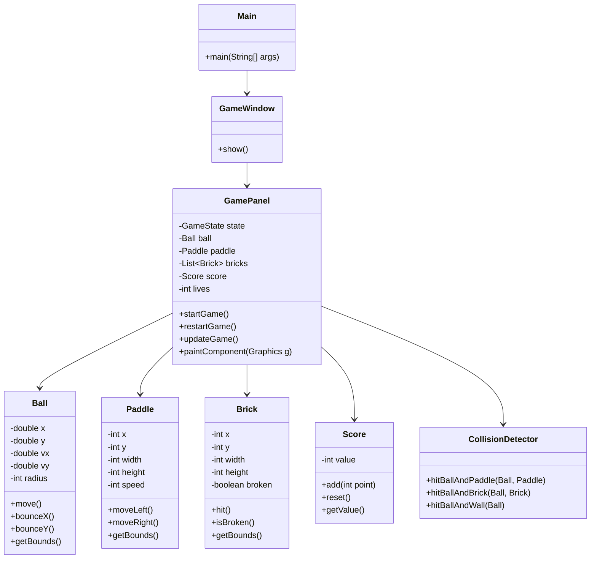

```mermaid
classDiagram
    class Main {
        +main(String[] args)
    }

    class GameWindow {
        +show()
    }

    class GamePanel {
        -GameState state
        -Ball ball
        -Paddle paddle
        -List~Brick~ bricks
        -Score score
        -int lives
        +startGame()
        +restartGame()
        +updateGame()
        +paintComponent(Graphics g)
    }

    class Ball {
        -double x
        -double y
        -double vx
        -double vy
        -int radius
        +move()
        +bounceX()
        +bounceY()
        +getBounds()
    }

    class Paddle {
        -int x
        -int y
        -int width
        -int height
        -int speed
        +moveLeft()
        +moveRight()
        +getBounds()
    }

    class Brick {
        -int x
        -int y
        -int width
        -int height
        -boolean broken
        +hit()
        +isBroken()
        +getBounds()
    }

    class CollisionDetector {
        +hitBallAndPaddle(Ball, Paddle)
        +hitBallAndBrick(Ball, Brick)
        +hitBallAndWall(Ball)
    }

    class Score {
        -int value
        +add(int point)
        +reset()
        +getValue()
    }

    Main --> GameWindow
    GameWindow --> GamePanel
    GamePanel --> Ball
    GamePanel --> Paddle
    GamePanel --> Brick
    GamePanel --> Score
    GamePanel --> CollisionDetector
```