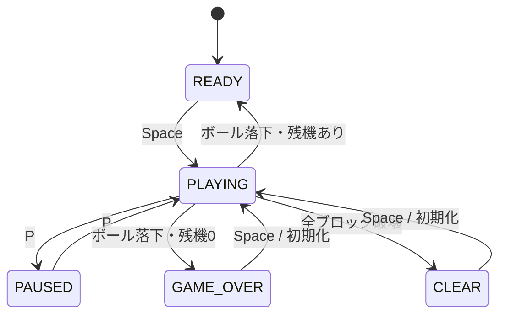

# ブロック崩しゲーム 処理記述書

## 1. 文書概要

本書は、Javaで開発する学習用ブロック崩しゲームの処理内容を記述する。  
基本設計書・詳細設計書で定義した機能・クラスを前提に、各処理の実行順序、条件分岐、状態遷移、疑似コードを整理する。

## 2. 前提条件

| 項目 | 内容 |
|---|---|
| 開発言語 | Java |
| GUI | Swing |
| 描画 | Java2D |
| ゲームループ | `javax.swing.Timer` |
| 想定FPS | 約60FPS |
| 更新間隔 | 16ms |
| 入力方式 | キーボード入力 |
| 保存処理 | なし |

## 3. 処理一覧

| 処理ID | 処理名 | 主担当クラス | 概要 |
|---|---|---|---|
| P-01 | アプリケーション起動処理 | Main | ゲームウィンドウを生成して表示する |
| P-02 | ゲーム初期化処理 | GamePanel | ボール、パドル、ブロック、スコア、残機を初期化する |
| P-03 | ゲーム開始処理 | GamePanel | READY状態からPLAYING状態へ変更する |
| P-04 | ゲームループ処理 | GamePanel | 一定間隔でゲーム状態を更新する |
| P-05 | キー入力処理 | GamePanel | キー押下・解放状態を管理する |
| P-06 | パドル移動処理 | Paddle / GamePanel | 入力状態に応じてパドルを左右に移動する |
| P-07 | ボール移動処理 | Ball | ボール座標を速度に応じて更新する |
| P-08 | 壁衝突処理 | CollisionDetector | ボールが壁に当たった場合に反射する |
| P-09 | パドル衝突処理 | CollisionDetector | ボールがパドルに当たった場合に反射する |
| P-10 | ブロック衝突処理 | CollisionDetector / Brick | ボールがブロックに当たった場合にブロックを破壊する |
| P-11 | スコア加算処理 | Score | ブロック破壊時にスコアを加算する |
| P-12 | ボール落下処理 | GamePanel | ボールが画面下に落ちた場合に残機を減らす |
| P-13 | クリア判定処理 | GamePanel | 全ブロック破壊時にCLEAR状態へ変更する |
| P-14 | ゲームオーバー判定処理 | GamePanel | 残機が0の場合にGAME_OVER状態へ変更する |
| P-15 | 描画処理 | GamePanel | ゲーム画面を描画する |
| P-16 | 一時停止処理 | GamePanel | PLAYINGとPAUSEDを切り替える |
| P-17 | リスタート処理 | GamePanel | ゲーム状態を初期状態に戻す |

---

## 4. P-01 アプリケーション起動処理

### 4.1 処理概要

アプリケーション開始時にゲームウィンドウを生成し、ゲーム画面を表示する。

### 4.2 処理フロー

```text
Main.main()
    ↓
GameWindowを生成する
    ↓
GamePanelを生成する
    ↓
GameWindowにGamePanelを追加する
    ↓
ウィンドウを表示する
```

### 4.3 疑似コード

```text
main(args):
    GameWindow window = new GameWindow()
    window.show()
```

---

## 5. P-02 ゲーム初期化処理

### 5.1 処理概要

ゲーム開始前またはリスタート時に、ゲーム内オブジェクトを初期状態に戻す。

### 5.2 初期化対象

| 対象 | 初期化内容 |
|---|---|
| state | READY |
| ball | 初期座標、初期速度に戻す |
| paddle | 初期座標に戻す |
| bricks | 初期配置で再生成する |
| score | 0に戻す |
| lives | 初期残機に戻す |
| leftPressed | false |
| rightPressed | false |

### 5.3 疑似コード

```text
initializeGame():
    state = READY
    ball = new Ball(initialX, initialY, speedX, speedY)
    paddle = new Paddle(initialX, initialY, width, height)
    bricks = createBricks()
    score.reset()
    lives = INITIAL_LIVES
    leftPressed = false
    rightPressed = false
```

---

## 6. P-03 ゲーム開始処理

### 6.1 処理概要

Spaceキー押下により、ゲーム状態をPLAYINGに変更する。

### 6.2 開始可能状態

| 現在状態 | 処理 |
|---|---|
| READY | PLAYINGに変更する |
| GAME_OVER | 初期化後、PLAYINGに変更する |
| CLEAR | 初期化後、PLAYINGに変更する |
| PLAYING | 何もしない |
| PAUSED | 何もしない |

### 6.3 疑似コード

```text
startGame():
    if state == READY:
        state = PLAYING
        return

    if state == GAME_OVER or state == CLEAR:
        initializeGame()
        state = PLAYING
        return
```

---

## 7. P-04 ゲームループ処理

### 7.1 処理概要

`Timer`によって一定間隔で呼び出され、ゲーム状態を1フレーム分更新する。

### 7.2 処理条件

| 状態 | 更新処理 |
|---|---|
| READY | 更新しない。描画のみ行う |
| PLAYING | 更新する |
| PAUSED | 更新しない。描画のみ行う |
| GAME_OVER | 更新しない。描画のみ行う |
| CLEAR | 更新しない。描画のみ行う |

### 7.3 疑似コード

```text
onTimerTick():
    updateGame()
    repaint()
```

```text
updateGame():
    if state != PLAYING:
        return

    updatePaddle()
    updateBall()
    checkWallCollision()
    checkPaddleCollision()
    checkBrickCollision()
    checkBallDrop()
    checkClear()
```

---

## 8. P-05 キー入力処理

### 8.1 処理概要

キーの押下・解放を受け取り、操作状態を更新する。

### 8.2 キー割り当て

| キー | 押下時処理 | 解放時処理 |
|---|---|---|
| ← | leftPressed = true | leftPressed = false |
| → | rightPressed = true | rightPressed = false |
| Space | startGame() | なし |
| P | togglePause() | なし |
| Esc | 終了 | なし |

### 8.3 疑似コード

```text
keyPressed(key):
    if key == LEFT:
        leftPressed = true

    if key == RIGHT:
        rightPressed = true

    if key == SPACE:
        startGame()

    if key == P:
        togglePause()

    if key == ESC:
        exitApplication()
```

```text
keyReleased(key):
    if key == LEFT:
        leftPressed = false

    if key == RIGHT:
        rightPressed = false
```

---

## 9. P-06 パドル移動処理

### 9.1 処理概要

左右キーの入力状態に応じてパドルを移動する。  
移動後、画面外に出ないように座標を補正する。

### 9.2 疑似コード

```text
updatePaddle():
    if leftPressed:
        paddle.moveLeft()

    if rightPressed:
        paddle.moveRight()

    paddle.clampToScreen()
```

```text
Paddle.moveLeft():
    x = x - speed
```

```text
Paddle.moveRight():
    x = x + speed
```

```text
Paddle.clampToScreen():
    if x < 0:
        x = 0

    if x + width > WINDOW_WIDTH:
        x = WINDOW_WIDTH - width
```

---

## 10. P-07 ボール移動処理

### 10.1 処理概要

ボールの現在座標に速度を加算し、次の座標へ移動させる。

### 10.2 疑似コード

```text
updateBall():
    ball.move()
```

```text
Ball.move():
    x = x + vx
    y = y + vy
```

---

## 11. P-08 壁衝突処理

### 11.1 処理概要

ボールが画面左端、右端、上端に衝突した場合、進行方向を反転する。  
画面下端は壁として扱わず、落下判定で処理する。

### 11.2 衝突条件

| 対象 | 条件 | 処理 |
|---|---|---|
| 左壁 | ball.x - radius <= 0 | X方向反転 |
| 右壁 | ball.x + radius >= WINDOW_WIDTH | X方向反転 |
| 上壁 | ball.y - radius <= 0 | Y方向反転 |
| 下端 | ball.y - radius > WINDOW_HEIGHT | 落下処理へ |

### 11.3 疑似コード

```text
checkWallCollision():
    if ball.left <= 0:
        ball.setLeft(0)
        ball.bounceX()

    if ball.right >= WINDOW_WIDTH:
        ball.setRight(WINDOW_WIDTH)
        ball.bounceX()

    if ball.top <= 0:
        ball.setTop(0)
        ball.bounceY()
```

```text
Ball.bounceX():
    vx = -vx
```

```text
Ball.bounceY():
    vy = -vy
```

---

## 12. P-09 パドル衝突処理

### 12.1 処理概要

ボールがパドルに衝突した場合、ボールを上方向へ反射させる。

### 12.2 判定条件

| 条件 | 内容 |
|---|---|
| ボール矩形とパドル矩形が交差している | 衝突とみなす |
| ボールが下方向へ移動している | `vy > 0` の場合のみ反射する |

### 12.3 疑似コード

```text
checkPaddleCollision():
    if ball.vy <= 0:
        return

    if ball.getBounds().intersects(paddle.getBounds()):
        ball.setBottom(paddle.top)
        ball.bounceY()
```

### 12.4 補足

最小実装では単純にY方向を反転する。  
拡張する場合は、パドルのどの位置に当たったかによってX方向速度を変える。

```text
hitPosition = (ball.centerX - paddle.centerX) / (paddle.width / 2)
ball.vx = hitPosition * MAX_BALL_SPEED_X
```

---

## 13. P-10 ブロック衝突処理

### 13.1 処理概要

未破壊のブロックとボールの衝突を判定する。  
衝突した場合、対象ブロックを破壊済みにし、ボールを反射し、スコアを加算する。

### 13.2 処理条件

| 条件 | 内容 |
|---|---|
| brick.isBroken() == true | 判定対象外 |
| ボール矩形とブロック矩形が交差 | 衝突とみなす |
| 1フレームで複数衝突 | 最初に検出した1ブロックのみ処理する |

### 13.3 疑似コード

```text
checkBrickCollision():
    for brick in bricks:
        if brick.isBroken():
            continue

        if ball.getBounds().intersects(brick.getBounds()):
            brick.hit()
            ball.bounceY()
            score.add(BRICK_SCORE)
            break
```

### 13.4 補足

最小実装では、衝突面の厳密判定は行わず、常にY方向反射とする。  
学習が進んだ後に、横衝突ならX反射、縦衝突ならY反射へ拡張する。

---

## 14. P-11 スコア加算処理

### 14.1 処理概要

ブロック破壊時にスコアを加算する。

### 14.2 疑似コード

```text
Score.add(point):
    value = value + point
```

### 14.3 呼び出し元

| 呼び出し元 | タイミング |
|---|---|
| checkBrickCollision() | ブロック破壊時 |

---

## 15. P-12 ボール落下処理

### 15.1 処理概要

ボールが画面下端を超えた場合、残機を1減らす。  
残機が残っている場合はボールとパドルを初期位置に戻し、READY状態にする。  
残機が0の場合はGAME_OVER状態にする。

### 15.2 疑似コード

```text
checkBallDrop():
    if ball.top <= WINDOW_HEIGHT:
        return

    lives = lives - 1

    if lives <= 0:
        state = GAME_OVER
        return

    ball.reset()
    paddle.reset()
    state = READY
```

---

## 16. P-13 クリア判定処理

### 16.1 処理概要

すべてのブロックが破壊済みであれば、ゲーム状態をCLEARに変更する。

### 16.2 疑似コード

```text
checkClear():
    for brick in bricks:
        if not brick.isBroken():
            return

    state = CLEAR
```

---

## 17. P-14 ゲームオーバー判定処理

### 17.1 処理概要

残機が0になった場合、ゲーム状態をGAME_OVERに変更する。  
本処理はボール落下処理内で実施する。

### 17.2 疑似コード

```text
if lives <= 0:
    state = GAME_OVER
```

---

## 18. P-15 描画処理

### 18.1 処理概要

現在のゲーム状態に応じて画面を描画する。  
Swingでは`paintComponent(Graphics g)`をオーバーライドして描画する。

### 18.2 描画対象

| 対象 | 描画条件 |
|---|---|
| 背景 | 常に描画 |
| スコア | 常に描画 |
| 残機 | 常に描画 |
| ボール | PLAYING / READY / PAUSED時に描画 |
| パドル | PLAYING / READY / PAUSED時に描画 |
| ブロック | 未破壊のブロックのみ描画 |
| メッセージ | 状態に応じて描画 |

### 18.3 疑似コード

```text
paintComponent(g):
    super.paintComponent(g)

    drawBackground(g)
    drawStatus(g)
    drawBricks(g)
    drawPaddle(g)
    drawBall(g)
    drawMessage(g)
```

```text
drawBricks(g):
    for brick in bricks:
        if not brick.isBroken():
            draw brick
```

```text
drawMessage(g):
    if state == READY:
        draw "Press SPACE to Start"

    if state == PAUSED:
        draw "PAUSED"

    if state == GAME_OVER:
        draw "GAME OVER"
        draw "Press SPACE to Restart"

    if state == CLEAR:
        draw "CLEAR"
        draw "Press SPACE to Restart"
```

---

## 19. P-16 一時停止処理

### 19.1 処理概要

Pキー押下により、PLAYINGとPAUSEDを切り替える。

### 19.2 疑似コード

```text
togglePause():
    if state == PLAYING:
        state = PAUSED
        return

    if state == PAUSED:
        state = PLAYING
        return
```

---

## 20. P-17 リスタート処理

### 20.1 処理概要

GAME_OVERまたはCLEAR状態でSpaceキーが押された場合、ゲームを初期化して再開始する。

### 20.2 疑似コード

```text
restartGame():
    initializeGame()
    state = PLAYING
```

---

## 21. ブロック生成処理

### 21.1 処理概要

行数・列数に従ってブロックを生成する。

### 21.2 配置条件

| 項目 | 内容 |
|---|---|
| 行数 | BRICK_ROWS |
| 列数 | BRICK_COLUMNS |
| 開始X座標 | 画面左側に余白を設ける |
| 開始Y座標 | スコア表示領域の下に配置する |
| ブロック間隔 | 数px程度空ける |

### 21.3 疑似コード

```text
createBricks():
    bricks = empty list

    for row from 0 to BRICK_ROWS - 1:
        for col from 0 to BRICK_COLUMNS - 1:
            x = START_X + col * (BRICK_WIDTH + BRICK_GAP)
            y = START_Y + row * (BRICK_HEIGHT + BRICK_GAP)
            brick = new Brick(x, y, BRICK_WIDTH, BRICK_HEIGHT)
            bricks.add(brick)

    return bricks
```

---

## 22. 状態遷移処理

### 22.1 状態遷移一覧

| 現在状態 | イベント | 次状態 |
|---|---|---|
| READY | Space押下 | PLAYING |
| PLAYING | P押下 | PAUSED |
| PAUSED | P押下 | PLAYING |
| PLAYING | ボール落下・残機あり | READY |
| PLAYING | ボール落下・残機0 | GAME_OVER |
| PLAYING | 全ブロック破壊 | CLEAR |
| GAME_OVER | Space押下 | PLAYING |
| CLEAR | Space押下 | PLAYING |

### 22.2 Mermaid図



---

## 23. 1フレーム更新の全体疑似コード

```text
updateGame():
    if state != PLAYING:
        return

    # 1. パドル移動
    if leftPressed:
        paddle.moveLeft()

    if rightPressed:
        paddle.moveRight()

    paddle.clampToScreen()

    # 2. ボール移動
    ball.move()

    # 3. 壁衝突判定
    if ball.left <= 0 or ball.right >= WINDOW_WIDTH:
        ball.bounceX()

    if ball.top <= 0:
        ball.bounceY()

    # 4. パドル衝突判定
    if ball.vy > 0 and ball.bounds intersects paddle.bounds:
        ball.setBottom(paddle.top)
        ball.bounceY()

    # 5. ブロック衝突判定
    for brick in bricks:
        if brick.isBroken():
            continue

        if ball.bounds intersects brick.bounds:
            brick.hit()
            ball.bounceY()
            score.add(BRICK_SCORE)
            break

    # 6. 落下判定
    if ball.top > WINDOW_HEIGHT:
        lives = lives - 1

        if lives <= 0:
            state = GAME_OVER
            return

        ball.reset()
        paddle.reset()
        state = READY
        return

    # 7. クリア判定
    if all bricks are broken:
        state = CLEAR
        return
```

---

## 24. 実装時の注意点

### 24.1 Timer処理

Swingの`Timer`はイベントディスパッチスレッド上で動作する。  
学習用の小規模ゲームでは問題ないが、重い処理を`updateGame()`内に入れないこと。

### 24.2 repaintの扱い

描画は直接呼び出さず、`repaint()`を呼び出す。  
実際の描画はSwing側が`paintComponent()`を呼び出したタイミングで行う。

### 24.3 衝突判定の単純化

最小実装では、ボールを円ではなく矩形として扱う。  
そのため、衝突判定は以下で十分とする。

```text
ball.getBounds().intersects(target.getBounds())
```

### 24.4 反射方向の単純化

ブロックとの衝突では、最初は常にY方向反射でよい。  
横から当たった場合のX方向反射は、完成後の改善項目とする。

### 24.5 入力状態の管理

キー押下時に直接パドルを動かすのではなく、`leftPressed` / `rightPressed` を更新する。  
実際の移動はゲームループ内で行う。  
これにより、キーを押し続けたときに自然な連続移動になる。

---

## 25. 完了条件

本処理記述書に基づく実装が完了した状態とは、以下を満たす状態である。

- アプリケーションを起動できる
- ゲーム画面が表示される
- Spaceキーでゲームを開始できる
- 左右キーでパドルを操作できる
- ボールが自動で移動する
- ボールが壁で反射する
- ボールがパドルで反射する
- ボールがブロックに当たるとブロックが消える
- ブロック破壊時にスコアが加算される
- ボール落下時に残機が減る
- 残機が0になるとゲームオーバーになる
- 全ブロック破壊でゲームクリアになる
- Pキーで一時停止・再開できる
- ゲームオーバーまたはクリア後にSpaceキーで再開始できる
